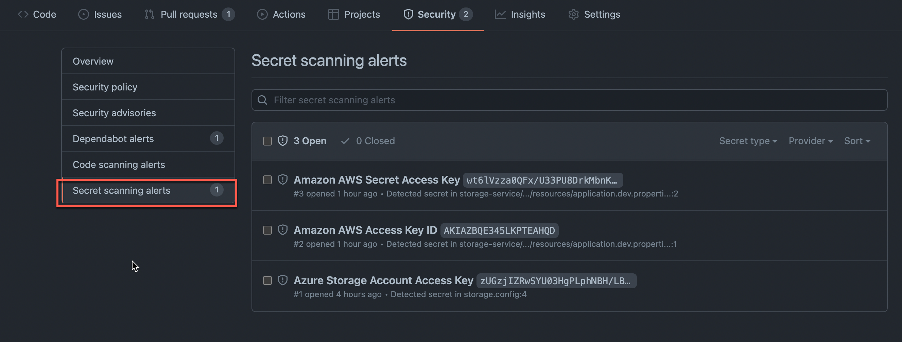
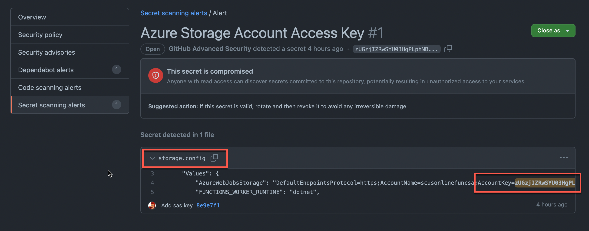
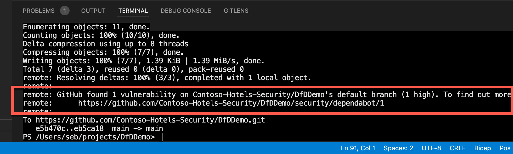
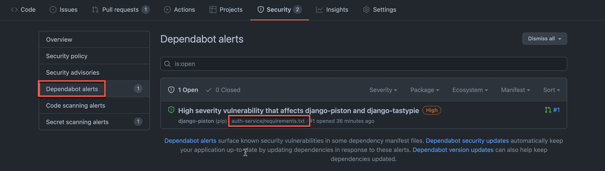
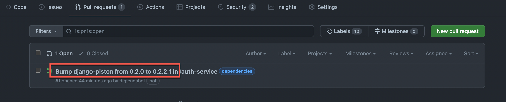

# Microsoft Defender for DevOps demo

This repository is used to demonstrate some of security capabilities of Microsoft Defender for DevOps.

## Use cases

### Secrets exposure

Identify leaked secrets in your repos using, Secret scanning. Those alerts will be reflected in MDfC.

Leaked secret alerts in the GitHub menu:

Alert details for an Azure Storage Account SAS (secret) stored in a config file:

### Vulnerabilities discovery

Discover vulnarable dependencies using GitHub Dependabot.

Message rceived by the dev while pushing code to the repo:

Details of the alert within the GitHub Dependabot menu:

As potential remediation Dependabot propose to upgrade the dependency verion, in a pull request:

#
